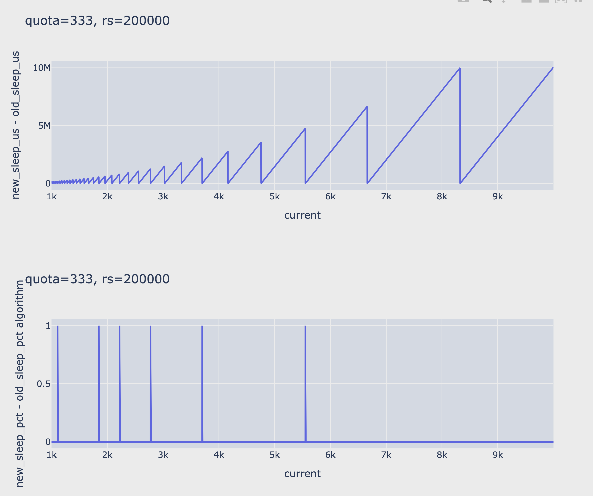

## main test result
```
=========================
curent(1000) quota(333)
=========================
org:            current(1000) quota(333) sleep_pct(66) throttle_us(388235)
after throttle dirtyrate 340
-------------------------
org_chg_100_to_10000:           current(1000) quota(333) sleep_pct(66) throttle_us(400600)
after throttle dirtyrate 333
-------------------------
my_func_use_double:             current(1000) quota(333) sleep_pct(66) throttle_us(400000)
after throttle dirtyrate 333
-------------------------
my_func_use_int_100:            current(1000) quota(333) sleep_pct(66) throttle_us(400000)
after throttle dirtyrate 333
=========================

=========================
curent(1000000) quota(333)
=========================
org:            current(1000000) quota(333) sleep_pct(99) throttle_us(19800000)
after throttle dirtyrate 10000
-------------------------
org_chg_100_to_10000:           current(1000000) quota(333) sleep_pct(99) throttle_us(499800000)
after throttle dirtyrate 400
-------------------------
my_func_use_double:             current(1000000) quota(333) sleep_pct(99) throttle_us(600400000)
after throttle dirtyrate 333
-------------------------
my_func_use_int_100:            current(1000000) quota(333) sleep_pct(99) throttle_us(600400000)
after throttle dirtyrate 333
=========================

=========================
curent(10000000000) quota(333)
=========================
org:            current(10000000000) quota(333) sleep_pct(99) throttle_us(19800000)
after throttle dirtyrate 100000000
-------------------------
org_chg_100_to_10000:           current(10000000000) quota(333) sleep_pct(99) throttle_us(1999800000)
after throttle dirtyrate 1000000
-------------------------
my_func_use_double:             current(10000000000) quota(333) sleep_pct(99) throttle_us(6006005800000)
after throttle dirtyrate 333
-------------------------
my_func_use_int_100:            current(10000000000) quota(333) sleep_pct(99) throttle_us(6006005806000)
after throttle dirtyrate 333
=========================
```

Based on the tests above, it seems that using the last method can achieve
relatively high precision.

In cases where the dirty page rate is not that high, the third method can also
achieve good accuracy. But the original code loses accuracy at a dirty page
rate of 1000MB/s.

##  test different current

Use python plotly to statistics:

```python
rs = 2000000
def test_one_current(current):
    quota=333
    sleep_pct = int((current - quota) * 100 / current)
    throttle_us = int(rs * sleep_pct /(100 - sleep_pct))

    tmp = (current - quota) / quota
    expect_throttle_us = int(rs * tmp)
    sleep_diff = expect_throttle_us - throttle_us

    sleep_pct2 = int(expect_throttle_us * 100 / (expect_throttle_us+rs) )
    pct_diff = abs(sleep_pct - sleep_pct2)
    return [sleep_diff,pct_diff]

test_one_current(1587)

x=[]
y=[]
y2=[]
for i in range(1000, 10000):
    x.append(i)
    y.append(test_one_current(i)[0])
    y2.append(test_one_current(i)[1])
import plotly.graph_objects as go

fig = go.Figure()

fig.add_trace(go.Scatter(x=x, y=y, mode='lines', name='Line'))

fig.update_layout(
    title='quota=333, rs=200000',
    xaxis_title='current',
    yaxis_title='new_sleep_us - old_sleep_us'
)
fig.show()
fig2 = go.Figure()
fig2.add_trace(go.Scatter(x=x, y=y2, mode='lines', name='Line'))

fig2.update_layout(
    title='quota=333, rs=200000 ',
    xaxis_title='current',
    yaxis_title='new_sleep_pct - old_sleep_pct algorithm'
)

fig2.show()
```

The first line chart shows the difference in linear adjustment values between
the two algorithms at different dirty page rates.


The second chart shows the difference in sleep percentage between the two
algorithms.



As the dirty page rate increases, the gap between the two will exhibit periodic
fluctuations, but the periods become longer and the maximum values also become
larger.

However, its sleep percentage fluctuates very little, only changing to 1 at
peak values.
